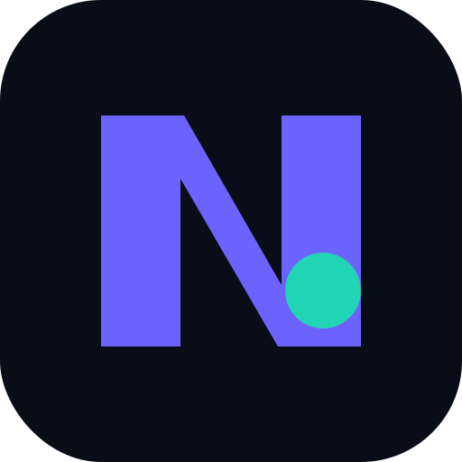
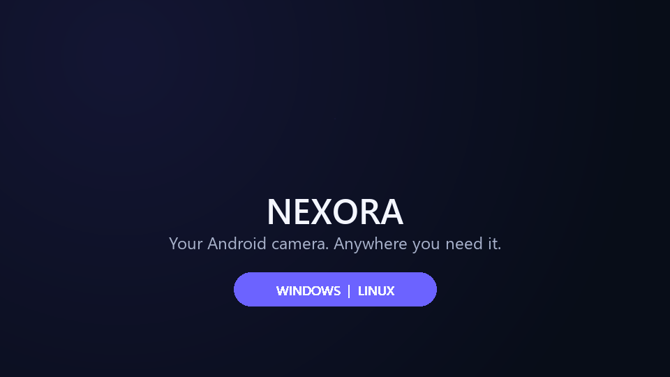

  

<h1 align="center">Nexora</h1>

  Turn your Android phone into a low latency virtual camera for Windows and Linux.

  <strong>Your phone. Your camera. Connected.</strong>

  <a href="https://github.com/akashlenvo/Nexora/releases/latest">Download</a> ·
  <a href="CHANGELOG.md">Changelog</a> ·
  <a href="LICENSE">MIT License</a>

  

Nexora is maintained by **Yves Godoy** and distributed under the MIT License. It is a renamed and redesigned continuation of the MIT licensed VCamdroid project. The original authorship and third party notices are preserved in [ATTRIBUTION.md](ATTRIBUTION.md).

## Features

<table>
  <tr>
    <td><strong>USB and WiFi</strong> Connect through ADB or scan a QR code on your local network.</td>
    <td><strong>Low latency video</strong> Hardware accelerated H.264 streaming over RTSP.</td>
  </tr>
  <tr>
    <td><strong>Windows virtual camera</strong> Native DirectShow output for OBS, Discord, Zoom and browsers.</td>
    <td><strong>Linux virtual camera</strong> Native V4L2 Loopback output through <code>/dev/video10</code>.</td>
  </tr>
  <tr>
    <td><strong>Camera controls</strong> Switch cameras, control flash and zoom, rotate, mirror and capture snapshots.</td>
    <td><strong>Stream controls</strong> Configure resolution, frame rate, bitrate, stabilization and image filters.</td>
  </tr>
  <tr>
    <td><strong>Private by design</strong> No accounts, advertisements, tracking, watermarks or cloud streaming.</td>
    <td><strong>Open source</strong> MIT licensed source code with automated builds for every platform.</td>
  </tr>
</table>

## Supported systems

<table>
  <tr>
    <th>System</th>
    <th>Architecture</th>
    <th>Virtual camera</th>
    <th>Connection</th>
  </tr>
  <tr>
    <td>Windows 10 and 11</td>
    <td>x64</td>
    <td>DirectShow</td>
    <td>USB and WiFi</td>
  </tr>
  <tr>
    <td>Linux Mint 22.x</td>
    <td>x86_64</td>
    <td>V4L2 Loopback</td>
    <td>USB and WiFi</td>
  </tr>
  <tr>
    <td>Ubuntu 24.04</td>
    <td>x86_64</td>
    <td>V4L2 Loopback</td>
    <td>USB and WiFi</td>
  </tr>
  <tr>
    <td>Android</td>
    <td>Phone camera source</td>
    <td>Camera2 and MediaCodec</td>
    <td>USB and WiFi</td>
  </tr>
</table>

Windows 11 and Linux Mint 22 have been tested manually. Ubuntu 24.04 is validated by the automated build workflow.

## Download and install

Open the [Releases](https://github.com/akashlenvo/Nexora/releases/latest) page and download the package for your computer. The matching Android APK is included in both desktop packages.

### Windows

1. Extract the Nexora ZIP to a permanent folder.
2. Open `install.bat` as administrator to register the virtual camera.
3. Start `Nexora.exe` and allow it through Windows Firewall when prompted.
4. Install the APK from the `apk` folder or run `install_apk.bat` with USB debugging enabled.

### Linux Mint and Ubuntu

1. Extract `Nexora-Linux-Mint-x86_64-*.tar.gz`.
2. Open a terminal inside the extracted directory.
3. Run `./install.sh` to install Nexora and configure the virtual camera.
4. Install the Android application with `./install_apk.sh`, or copy the APK from the `apk` directory to the phone.

The installer configures **Nexora Virtual Camera** as `/dev/video10`. Secure Boot may require approval of the DKMS module during installation. More information is available in [linux/README.md](linux/README.md).

## Connect your phone

### WiFi

Keep the phone and computer on the same local network. Open **Connect with QR** in Nexora Studio and scan the code using the Android application.

### USB

Enable Developer options and USB debugging on Android. Connect the cable, accept the authorization prompt and open Nexora on both devices. The required ADB tunnels are configured automatically.

Choose the phone under **Video source**. In OBS, Discord, Zoom or another application, select **Nexora Virtual Camera**.

## Compatibility note

Always use the desktop client and Android APK from the same Nexora release. An older upstream bundle mixed incompatible protocol versions and could crash in `VCRUNTIME140.dll` while reading the phone model. Nexora includes a matching Android descriptor and a bounds checked Windows parser.

## Building from source

GitHub Actions builds Android, Windows and Linux automatically. Local build instructions are available in [docs/BUILDING.md](docs/BUILDING.md).

  <strong>Android:</strong> <code>android/</code> 
  <strong>Windows:</strong> <code>windows/Nexora.sln</code> 
  <strong>Linux:</strong> <code>windows/CMakeLists.txt</code> and <code>linux/</code> 
  <strong>Brand assets:</strong> <code>assets/brand/</code> 
  <strong>Release workflows:</strong> <code>.github/workflows/</code>

## License and credits

Nexora modifications: Copyright © 2026 Yves Godoy.

Original VCamdroid code: Copyright © 2026 darusc. DirectShow support uses the separately licensed [softcam](https://github.com/tshino/softcam) submodule by Toshihiko Shimizu. All required notices are preserved in [LICENSE](LICENSE), [ATTRIBUTION.md](ATTRIBUTION.md) and the third party source tree.
